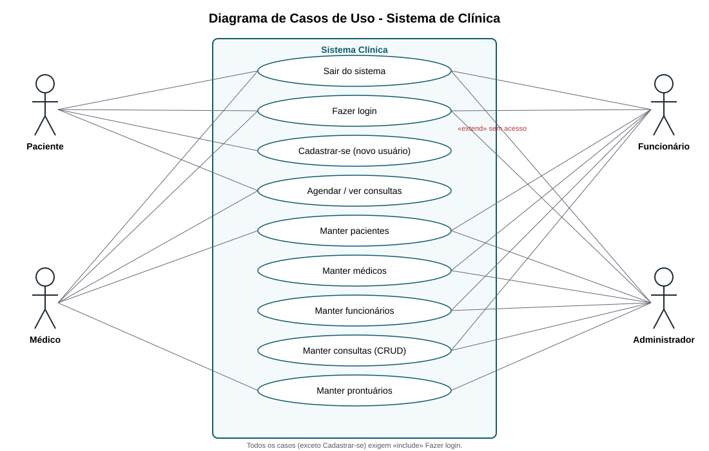

# 🏥 Sistema de Gestão de Clínica

Sistema web em **Spring Boot + HTML (Thymeleaf) + MySQL** para cadastro de pacientes, médicos e funcionários, agendamento de consultas e prontuários, com login obrigatório.



## Funcionalidades
- CRUD completo de **Pacientes, Médicos, Funcionários, Consultas e Prontuários**
- **Login obrigatório** (Spring Security + BCrypt) com perfis ADMIN, MÉDICO, FUNCIONÁRIO e PACIENTE
- **Auto-cadastro**: quem não tem acesso clica em *Cadastre-se* na tela de login
- Médicos e funcionários recebem login ao serem cadastrados

## Estrutura
```
clinica/
├── pom.xml
├── sql/clinica.sql                  # script do banco + dados de exemplo
├── docs/
│   ├── diagrama-caso-de-uso.svg     # diagrama de casos de uso
│   └── DOCUMENTACAO.md              # requisitos, casos de uso, modelo
└── src/main/
    ├── java/com/clinica/
    │   ├── model/        # entidades JPA
    │   ├── repository/   # Spring Data
    │   ├── controller/   # CRUD + login/cadastro
    │   └── config/       # segurança e conversores
    └── resources/
        ├── templates/    # páginas HTML
        ├── static/css/
        └── application.properties
```

## Manual de instalação
### Pré-requisitos
- Java 17+ · Maven 3.9+ · MySQL 8

### Passo a passo
1. **Crie o banco**
   ```bash
   mysql -u root -p < sql/clinica.sql
   ```
2. **Configure a conexão** em `src/main/resources/application.properties` (usuário/senha do MySQL).
3. **Execute**
   ```bash
   mvn spring-boot:run
   ```
4. Acesse **http://localhost:8080**

### Usuários de teste (senha `123456`)
| Login | Perfil |
|-------|--------|
| admin | Administrador |
| drjoao | Médico |
| maria | Funcionário |
| ana | Paciente |

## Manual de uso
1. **Login** – informe usuário e senha. Sem acesso? Clique em **Cadastre-se**.
2. **Menu** – mostra apenas as telas permitidas ao seu perfil.
3. **Cadastros** – em cada tela use **+ Novo**, **Editar** ou **Excluir**. Em médicos/funcionários/pacientes preencha *Login* e *Senha* para liberar o acesso.
4. **Consultas** – escolha paciente, médico, data/hora e status.
5. **Prontuários** – o médico registra queixa, diagnóstico e prescrição.
6. **Sair** – botão no canto superior direito.

## Publicar no GitHub
```bash
git init
git add .
git commit -m "Sistema de clínica - Spring Boot"
git branch -M main
git remote add origin https://github.com/SEU_USUARIO/clinica.git
git push -u origin main
```

## Tecnologias
Java 17 · Spring Boot 3.3 · Spring Security · Spring Data JPA · Thymeleaf · MySQL 8
